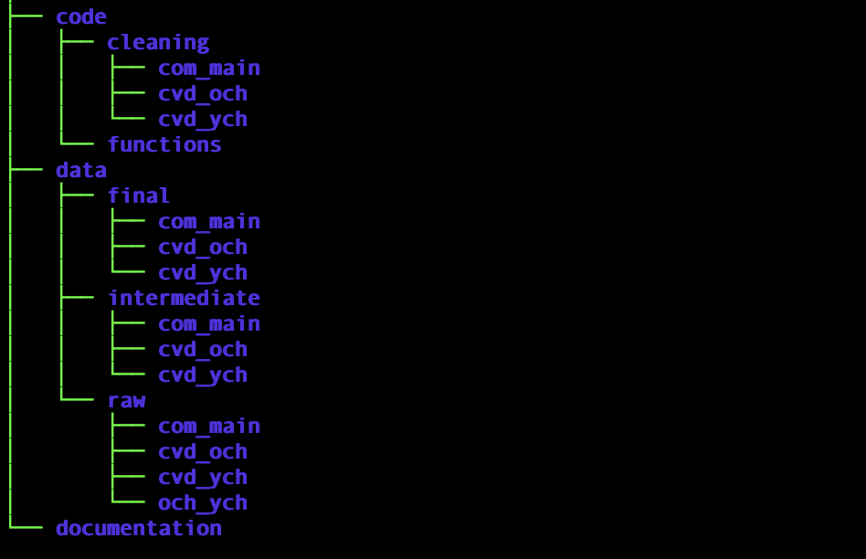

# young\_lives\_data\_preparation

## Overview 
This is a repository to clean and merge data from The Young Lives Study for three survey types (the main community survey and COVID-19 telephone surveys for older and younger children). This cohort study followed children for over 20 years in four low- and middle-income countries and conducted surveys with children, caregivers and community members. Data from the community survey and COVID-19 surveys are publicly stored as hundreds of datafiles that cannot be merged or readily used for longitudinal analysis. This repository includes code to clean variables that are common across rounds and merge data for analysis. After cleaning, these surveys can also be linked and analysed with other types of surveys that comprise the Young Lives Study.

The full list of available functions is outlined below:

  * `0_requirements`: a function to load in all packages needed to run this cleaning code and to create a consistent R operating environment.
  * `fuzzy_match`: a function that helps to identify variables that are common across rounds, even if slightly differently named.
  * `clean`: the main cleaning function for raw data from .dta files.
  * `clean_step1_label_error`: a function that helps identify which variables and data files have linkage variables that are not completely labelled or cast (e.g., labelled "1001" in one .dta file and "et1001" in another; cast as a factor variable in one .dta file and numeric in another).
  * `clean_step2_complete`: a function to apply the rest of the normal `clean` function after the error in the linkage variable has been rectified.
  * `low_memory_clean`: a function that prevents R's memory from being superseded when too many variables are selected for analysis and merges .dta files in a format that can be cleaned.
  * `low_memory_clean_v2`: a function that performs the functions of `low_memory_clean` after clean_step1_label_error and clean_step2_complete functions are applied due to errors in the linkage variable.
  * `merge_intermediate`: a function that creates cohort survey data by merging each round of cleaned data together.

The most basic workflow will use `0_requirements`, `clean`, and `merge_intermediate` to create longitudinal data that is ready for analysis.

Detailed information on the capability of these cleaning functions is found below in section 3 on [Automated functions](#3-automated-functions).

README table of contents:
1. [Repository contents](#1-repository-contents)
2. [File naming conventions guide](#2-file-naming-conventions-guide)
3. [Automated functions](#3-automated-functions)
4. [Additional notes](#4-additional-notes)

## 1. Repository contents

* [code](code): directory to store `.R` and `.Rmd` scripts that interact with data stored in the `data` dir. Contains two subdirectories: 
    * [cleaning](code/cleaning)
    * [functions](code/functions)

* [data](data): directory to store data files (data are only stored locally and never remotely on GitHub). Contains three subdirectories:
    * [final](data/final): stores the final datasets that are ready for analysis and tailored to individual needs (stored locally). 
    * [intermediate](data/intermediate): stores datasets after merging all of the separately cleaned files together locally. Contains three additional sub-directories, `com_main`, `cvd_och`, `cvd_ych`, each of which holds the raw data for their respective survey type.
    * [raw](data/raw): stores raw data locally that needs to be cleaned. Likewise, it has three subdirectories for each survey type. 

* [documentation](documentation): includes helpful files such as `data_setup_overview.Rmd` (provides overall steps for how to set up data analysis) and `data_naming_conventions.md` (provides in-depth instructions for naming the data).

* [.gitignore](.gitignore): a plain text file for the .git folder, telling Git not to keep track of certain files / directories by using the expressions in the file. Preserves data privacy and respects data ownership.

* [young\_lives\_data\_preparation.Rproj](young_lives_data_preparation.Rproj): `Rproject` file that users to place the `young_lives_data_preparation` repository wherever one likes on his or her local computer. Combined with R's `here` package, this allows one to avoid hardcoding explicit file paths and instead use relative paths.

### At a glance

## 2. File naming conventions guide

For full instructions, see the [documentation\_naming_conventions.md](documentation/naming_conventions.md) markdown file. Below, the main points are summarised:

#### Tag meanings for the below guides:

* `[survey type] = {com_main, cvd_och, cvd_ych}` for main community survey, covid for older children, and covid survey for younger children, respectively.
* `[round number] = {1, 2, 3, ...}`
* `[country abbreviation] = {et, in, pe, vt}` for Ethiopia, India, Peru, and Vietnam, respectively.

#### Variable naming conventions

Variables are renamed to be consistent in the cleaning scripts so that they can be easily merged across rounds. A separate `round` column denotes which round they originated from during data collection.
 
#### `.R` filenames

Scripts for cleaning raw data and thus generating intermediate data. Stored in the appropriate `code` subdirectory:

`[survey type]_r[round number]_[country abbreviation].R`

example: `com_r1_et.R`

#### Raw data files

Files that need cleaning:

`data/raw/[survey type]/r[round number]_[country abbreviation]_[file descriptor].[extension]`

example: `data/raw/com/r1_et_main.dta`

#### Intermediate data files

Cleaned datasets:

`data/intermediate/[survey type]/r[round number]_[country abbreviation].[extension]`

example: `data/intermediate/com/r1_et.rds`

## 3. Automated functions

These automated functions are tailored to the Young Lives Surveys but can also be tailored to cleaning other datasets in the future. Their main properties are:

1. Searching variables that share common root names across all data files and rounds to create a cohort dataset
2. Allowing users to select variables that they want to analyse in a streamlined automated way 
    * Includes useful error messages if variables or datafile names are misspecified
    * Alternatively, allows users the option of passing no pre-selected variables to determine which variables might be useful for analysis
    * Outlines possible linkage variables that could be used when unknown
3. Providing a searchable data dictionary of the remaining variables that were not selected for data cleaning 
    * Useful for checking completeness and decisions to later include new variables
4. Permitting the data cleaning of separate raw data files at once and in a streamlined way
5. Reading in and automatically applying factor labels that were partially coded in the raw Young Lives data
6. Allowing data users to specify which variables are missing or skips and code them as *NA* automatically throughout the data
7. Outputting summary of the percentage of missingness by each variable
8. Outputting searchable data dictionaries of all selected variables in R, with descriptions of their labels and type
9. Merging cleaned data across rounds by survey type and automatically labeling which round the variable came from

**Users are encouraged to review the scripts for the automated functions directly to understand the full properties of each function.**

## 4. Additional notes

* Data must separately be requested before data cleaning and use from the [UK Data Service](https://beta.ukdataservice.ac.uk/datacatalogue/series/series?id=2000060).
* `.dta` data files from The Young Lives Study are used as the basis of data cleaning. Researchers may be interested in cleaning base variables in another fashion or including other variables in longitudinal analyses. The cleaning scripts are extensive but not exhaustive.
* Data are saved as `.rds` files at the intermediate stage to preserve the initial data cleaning formatting. 
* The [functions](code/functions) scripts contain in-line notation that explains different functions, which are tailored to this data but can be re-adapted to clean other data.

**Please include the below citation if this code is used in analysing Young Lives data or if the functions are adapted to future analyses in other datasets. More information on data preparation standards can also be found in the linked citation. Questions and comments can be addressed to Ilan Cerna-Turoff at it2208@caa.columbia.edu.** 

# Citation:
**Insert final journal citation here[article] (web_address/)**
